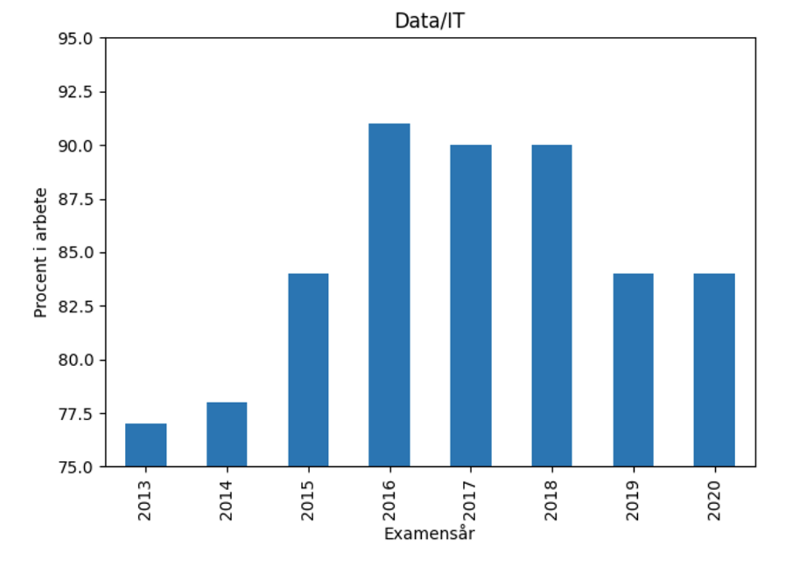
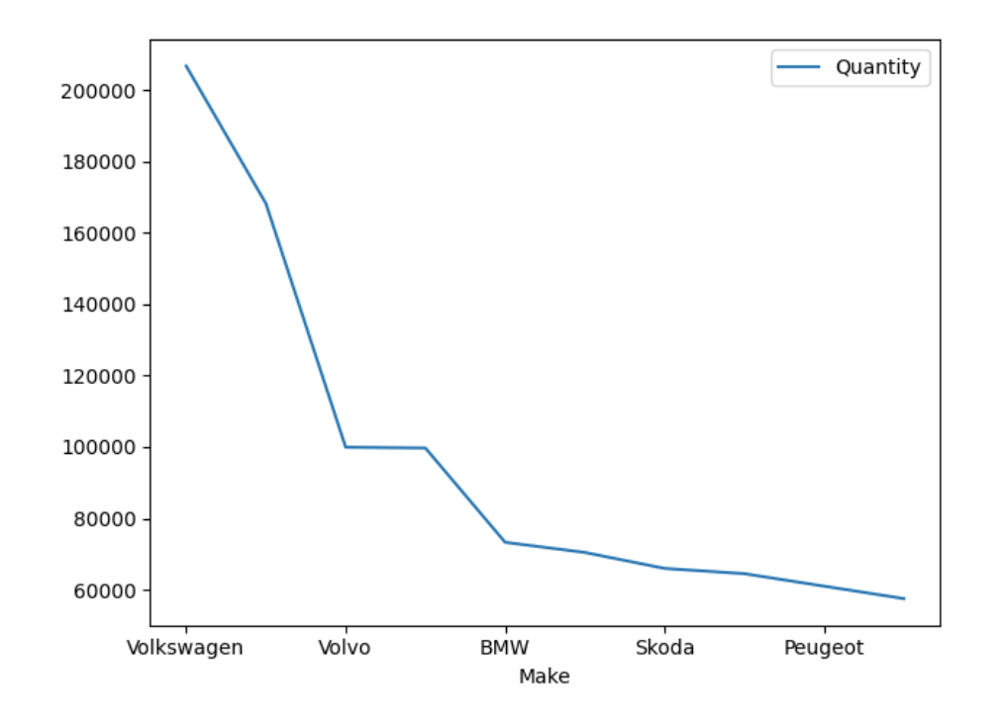

# Exercise 0

## Task 2. Theory questions

---

**a) When can you make line charts and when can't you make line charts?**

### Use line charts when:

- Data is continuous and has a logical order (usually over time).

  - Example: stock prices over a month, temperature changes during a day.

- You're showing trends or patterns over time.

  - Example: website traffic each day for a week.

- You want to compare multiple series of continuous data.

  - Example: comparing sales of two products over 12 months.

- Your x-axis represents something measurable or sequential, like:

  - Time (days, months, years)

  - Distance

  - Experimental steps

### Avoid line charts when:

- Data is categorical with no natural order.

Bad Example: plotting “Red”, “Blue”, “Green” as x-axis categories.

Why? Line charts suggest continuity, but colors aren’t sequential.

- You're showing individual values, not trends.

Better: use bar charts or scatter plots for discrete comparisons.

- Data points are not connected in meaning.

Connecting unrelated data with lines can mislead the viewer.

- You have too much noise or many lines, making it hard to read.

If your chart has 10+ lines and it's messy, consider breaking it into smaller charts.

### Quick Rule of Thumb:

- Use line charts for **time series** and **trends**.

- Don’t use them for **categories**, **unrelated points**, or **isolated data**.

---

**b) Whats wrong with this chart?**



Y-axis does not start at zero: it begins at 75, not 0.

- This can distort the visual interpretation of the data.

- It exaggerates differences between bars that might actually be small.

**Why it's an issue:**
Even though the actual difference between, say, 85% and 90% is just 5 percentage points, the visual gap looks huge because the y-axis is cut off.

This can unintentionally mislead viewers into thinking the changes are more dramatic than they are.

---

**c) Whats wrong with this chart?**



- The x-axis shows car brands (Volkswagen, Volvo, etc.), which are categorical, not continuous.

- Line charts are meant to show trends over continuous data (like time or measurements).

- Using a line chart here suggests a progression or connection between brands, which doesn’t make sense—there’s no natural order or “flow” from Volkswagen to Peugeot.

**A bar chart is the better choice because:**

- It clearly shows the quantity for each brand.

- It doesn’t imply any connection or trend between categories.

---

**d) What is the difference between OOP approach and plt approach in drawing graphs.**

The OOP approach and the plt approach in Matplotlib both let you draw graphs—but they work a bit differently under the hood.

### plt Approach (Pyplot Interface)

Also called the state-based interface, this is the simpler and more intuitive way to create plots, especially for beginners.

🧠 How it works:

- Think of it like a “drawing mode”: every plt.plot() or plt.title() affects the current figure.

- It’s like using a whiteboard where each new command updates what’s on it.

✅ Pros:

- Very easy and fast for small plots.

- Great for quick visualizations or learning.

❌ Cons:

- Can get messy or hard to control with multiple subplots or complex layouts.

- Less explicit = harder to debug or customize in big projects.

🔍 Example:

```py
import matplotlib.pyplot as plt 
plt.plot([1, 2, 3], [4, 5, 6]) 
plt.title("Simple Plot") 
plt.xlabel("X") plt.ylabel("Y") 
plt.show()
```


### OOP Approach (Object-Oriented Programming)

This is a more flexible and powerful way, especially useful when building complex or professional plots.

🧠 How it works:

- You explicitly create figure and axes objects, then call methods on them.

- You're not relying on the "current state" of the plot—you're managing everything directly.

✅ Pros:

- Better control over multiple subplots, axes, and figures.

- More readable and organized for complex visualizations.

❌ Cons:

- Slightly more code.

- A bit more advanced for beginners.

🔍 Example:

```py
import matplotlib.pyplot as plt

fig, ax = plt.subplots()  # Create figure and axes
ax.plot([1, 2, 3], [4, 5, 6])
ax.set_title("Simple Plot")
ax.set_xlabel("X")
ax.set_ylabel("Y")
plt.show()
```

| Feature               | plt (State-Based)       | OOP (Figure & Axes Objects)       |
| --------------------- | ----------------------- | --------------------------------- |
| Simplicity            | ✅ Easier for beginners | ❌ Slightly more complex          |
| Control & Flexibility | ❌ Limited for subplots | ✅ Excellent for complex layouts  |
| Best For              | Quick plots, learning   | Dashboards, professional projects |
| Explicit Structure    | ❌ Implicit             | ✅ Very clear and organized       |


---
**e) How do you draw an arrow in matplotlib?**

1. Basic Arrow with plt.arrow()
This is the simplest way to draw a straight arrow on a plot.

Example:
```py
import matplotlib.pyplot as plt

plt.figure()
plt.xlim(0, 10)
plt.ylim(0, 10)
# Draw arrow from (2, 2) pointing 3 units right and 4 units up
plt.arrow(2, 2, 3, 4, head_width=0.5, head_length=0.7, fc='blue', ec='blue')

plt.grid(True)
plt.show()
```
 Notes:
- plt.arrow(x, y, dx, dy, ...)

- It draws an arrow from point (x, y) to (x+dx, y+dy).

- Not always ideal for annotations or adjusting size with figure scaling.

2. Better Arrow with ax.annotate()
This is the recommended and more powerful method, especially for labeling or pointing at stuff.

Example:

```py
import matplotlib.pyplot as plt

fig, ax = plt.subplots()
ax.plot([1, 2, 3], [4, 5, 6])

# Annotate with an arrow
ax.annotate('Here!', xy=(2, 5), xytext=(1.5, 6),
             arrowprops=dict(facecolor='black', arrowstyle='->'))

plt.show()
```

Why it's better:
- You can control arrow style, direction, labels, etc.

- Works well with both text and shapes.

- Handles coordinate transforms better than plt.arrow().
